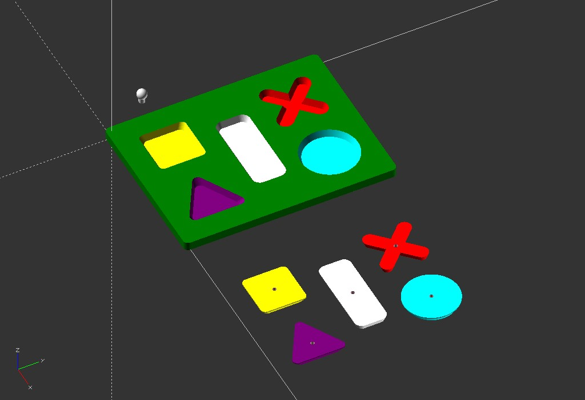

# 3dprint-toy-simple-puzzle
 

## Toddlers puzzle

Simple puzzle for toddlers Made with OpenSCAD. Requires  M3 8mm screws for the small handles.

## Puzzle pour bébés

Puzzle simple pour bébés. Réalisé avec OpenSCAD. Nécessite des vis M3 de 8mm pour l'assemblage des petites poignées.

